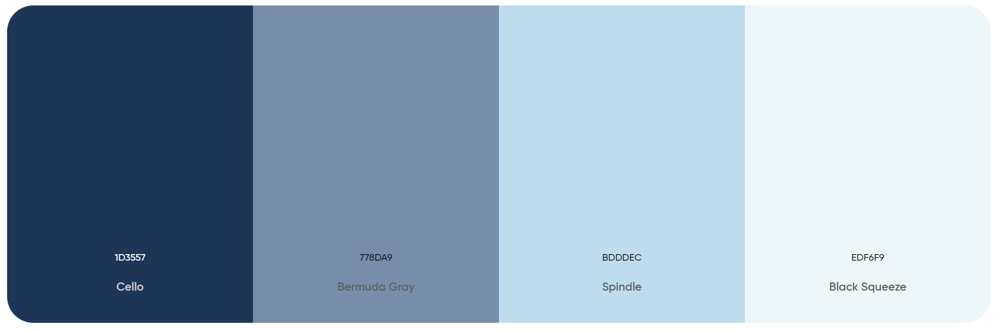

# Documenting the Design

## Fonts:
- All text is presented in the "Inter" font imported from Google Fonts. Two different classes of this font have been created and added to the index.css file, a regular class and a bold class.

## Colour Palette:
- The main colour palette used for this web app can be seen below. It mostly consists of different shades of blue to match with the background image used on the landing page.
- The background colour for all other pages is #bdddec.
- The other colours are used for text, buttons, and boxes.

## Site Components:

### Landing Page
- Upon starting the React app users are brought to the landing page which allows them to choose which user type they would like to sign in as: Admin or Patient.

### Login Pages
- After choosing which user type to sign in as, the users are prompted to fill in either their username and password (for admins) or their fullname and 3-character code (for patients).
 

### Admin Dashboard
- After logging in as the admin, the admin users can see a table of all the currents patients and remove any that have been served, and they can add new patients. When adding a new patient they just need to enter the full name and the severity of their injuries (1-10), the 3-character code then gets generated automatically for that patient. The admin has the option to logout at all times.

### Patient Dashboard
- After logging in as a patient, the patient users can see their queue position as well as their estimated wait time. For simplicity, the wait time is calculated as 10 minutes per position in the queue, so if the patient is first in the queue then their wait time is 10 minutes, if they're second in the queue then it's 20 minutes, and so on. The queue position and wait time is updated every 30 seconds to see if any changes have been made. The patient has the option to logout at all times.
